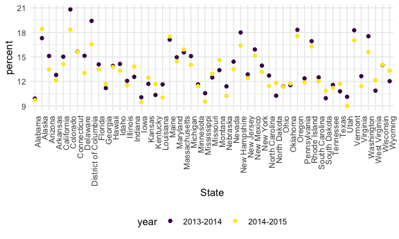
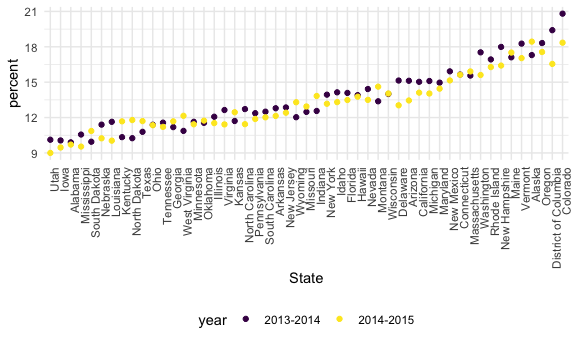
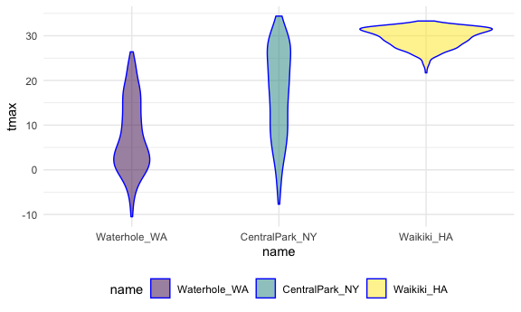

R_Practice_data_wangling2
================
2023-03-16

``` r
library(tidyverse)
```

    ## ── Attaching core tidyverse packages ──────────────────────── tidyverse 2.0.0 ──
    ## ✔ dplyr     1.1.0     ✔ readr     2.1.4
    ## ✔ forcats   1.0.0     ✔ stringr   1.5.0
    ## ✔ ggplot2   3.4.1     ✔ tibble    3.2.0
    ## ✔ lubridate 1.9.2     ✔ tidyr     1.3.0
    ## ✔ purrr     1.0.1     
    ## ── Conflicts ────────────────────────────────────────── tidyverse_conflicts() ──
    ## ✖ dplyr::filter() masks stats::filter()
    ## ✖ dplyr::lag()    masks stats::lag()
    ## ℹ Use the ]8;;http://conflicted.r-lib.org/conflicted package]8;; to force all conflicts to become errors

``` r
library(rvest)
```

    ## 
    ## Attaching package: 'rvest'
    ## 
    ## The following object is masked from 'package:readr':
    ## 
    ##     guess_encoding

``` r
library(httr)

knitr::opts_chunk$set(
  fig.width = 6,
  fig.asp = .6,
  out.width = "90%"
)

theme_set(theme_minimal() + theme(legend.position = "bottom"))

options(
  ggplot2.continuous.colour = "viridis",
  ggplot2.continuous.fill = "viridis"
)

scale_colour_discrete = scale_colour_viridis_d
scale_fill_discrete = scale_fill_viridis_d
```

## script a table from website

Use read_html to get the table

``` r
url = "http://samhda.s3-us-gov-west-1.amazonaws.com/s3fs-public/field-uploads/2k15StateFiles/NSDUHsaeShortTermCHG2015.htm"
drug_use_html = read_html(url)

drug_use_html
```

    ## {html_document}
    ## <html lang="en">
    ## [1] <head>\n<link rel="P3Pv1" href="http://www.samhsa.gov/w3c/p3p.xml">\n<tit ...
    ## [2] <body>\r\n\r\n<noscript>\r\n<p>Your browser's Javascript is off. Hyperlin ...

get the first table

``` r
table_marj = 
  drug_use_html %>% 
  html_table() %>% 
  first() %>%
  slice(-1) 

table_marj
```

    ## # A tibble: 56 × 16
    ##    State 12+(2…¹ 12+(2…² 12+(P…³ 12-17…⁴ 12-17…⁵ 12-17…⁶ 18-25…⁷ 18-25…⁸ 18-25…⁹
    ##    <chr> <chr>   <chr>   <chr>   <chr>   <chr>   <chr>   <chr>   <chr>   <chr>  
    ##  1 Tota… 12.90a  13.36   0.002   13.28b  12.86   0.063   31.78   32.07   0.369  
    ##  2 Nort… 13.88a  14.66   0.005   13.98   13.51   0.266   34.66a  36.45   0.008  
    ##  3 Midw… 12.40b  12.76   0.082   12.45   12.33   0.726   32.13   32.20   0.900  
    ##  4 South 11.24a  11.64   0.029   12.02   11.88   0.666   28.93   29.20   0.581  
    ##  5 West  15.27   15.62   0.262   15.53a  14.43   0.018   33.72   33.19   0.460  
    ##  6 Alab… 9.98    9.60    0.426   9.90    9.71    0.829   26.99   26.13   0.569  
    ##  7 Alas… 19.60a  21.92   0.010   17.30   18.44   0.392   36.47a  40.69   0.015  
    ##  8 Ariz… 13.69   13.12   0.364   15.12   13.45   0.131   31.53   31.15   0.826  
    ##  9 Arka… 11.37   11.59   0.678   12.79   12.14   0.538   26.53   27.06   0.730  
    ## 10 Cali… 14.49   15.25   0.103   15.03   14.11   0.190   33.69   32.72   0.357  
    ## # … with 46 more rows, 6 more variables: `26+(2013-2014)` <chr>,
    ## #   `26+(2014-2015)` <chr>, `26+(P Value)` <chr>, `18+(2013-2014)` <chr>,
    ## #   `18+(2014-2015)` <chr>, `18+(P Value)` <chr>, and abbreviated variable
    ## #   names ¹​`12+(2013-2014)`, ²​`12+(2014-2015)`, ³​`12+(P Value)`,
    ## #   ⁴​`12-17(2013-2014)`, ⁵​`12-17(2014-2015)`, ⁶​`12-17(P Value)`,
    ## #   ⁷​`18-25(2013-2014)`, ⁸​`18-25(2014-2015)`, ⁹​`18-25(P Value)`

## CSS selector for non-table

``` r
swm_html = 
  read_html("https://www.imdb.com/list/ls070150896/")

title_vec = 
  swm_html %>%
  html_elements(".lister-item-header a") %>%
  html_text()

gross_rev_vec = 
  swm_html %>%
  html_elements(".text-small:nth-child(7) span:nth-child(5)") %>%
  html_text()

runtime_vec = 
  swm_html %>%
  html_elements(".runtime") %>%
  html_text()

swm_df = 
  tibble(
    title = title_vec,
    rev = gross_rev_vec,
    runtime = runtime_vec)
```

## API request

``` r
nyc_water = 
  GET("https://data.cityofnewyork.us/resource/ia2d-e54m.csv") %>% 
  content("parsed")
```

    ## Rows: 43 Columns: 4
    ## ── Column specification ────────────────────────────────────────────────────────
    ## Delimiter: ","
    ## dbl (4): year, new_york_city_population, nyc_consumption_million_gallons_per...
    ## 
    ## ℹ Use `spec()` to retrieve the full column specification for this data.
    ## ℹ Specify the column types or set `show_col_types = FALSE` to quiet this message.

can’t csv

``` r
nyc_water = 
  GET("https://data.cityofnewyork.us/resource/ia2d-e54m.json") %>% 
  content("text") %>%
  jsonlite::fromJSON() %>%
  as_tibble()
```

for updating data sets that are large

``` r
brfss_smart2010 = 
  GET("https://chronicdata.cdc.gov/resource/acme-vg9e.csv",
      query = list("$limit" = 100)) %>% 
  content("parsed")
```

    ## Rows: 100 Columns: 23
    ## ── Column specification ────────────────────────────────────────────────────────
    ## Delimiter: ","
    ## chr (14): locationabbr, locationdesc, class, topic, question, response, data...
    ## dbl  (6): year, sample_size, data_value, confidence_limit_low, confidence_li...
    ## lgl  (3): data_value_footnote_symbol, data_value_footnote, locationid
    ## 
    ## ℹ Use `spec()` to retrieve the full column specification for this data.
    ## ℹ Specify the column types or set `show_col_types = FALSE` to quiet this message.

## String (str_detect for find; str_replace fpr replace/recode; )

``` r
string_vec = c("my", "name", "is", "jeff")

str_detect(string_vec, "jeff")
```

    ## [1] FALSE FALSE FALSE  TRUE

``` r
str_replace(string_vec, "jeff", "Jeff")
```

    ## [1] "my"   "name" "is"   "Jeff"

``` r
recode(string_vec, "jeff" = "Jeff")
```

    ## [1] "my"   "name" "is"   "Jeff"

str_detect for start with ^, end with \$

``` r
string_vec = c(
  "i think we all rule for participating",
  "i think i have been caught",
  "i think this will be quite fun actually",
  "it will be fun, i think"
  )

str_detect(string_vec, "^i think")
```

    ## [1]  TRUE  TRUE  TRUE FALSE

``` r
str_detect(string_vec, "i think$")
```

    ## [1] FALSE FALSE FALSE  TRUE

find pattern \[\]

example1

``` r
string_vec = c(
  "Y'all remember Pres. HW Bush?",
  "I saw a green bush",
  "BBQ and Bushwalking at Molonglo Gorge",
  "BUSH -- LIVE IN CONCERT!!"
  )

str_detect(string_vec,"[Bb]ush")
```

    ## [1]  TRUE  TRUE  TRUE FALSE

example2

``` r
string_vec = c(
  '7th inning stretch',
  '1st half soon to begin. Texas won the toss.',
  'she is 5 feet 4 inches tall',
  '3AM - cant sleep :('
  )

str_detect(string_vec, "^[0-9][a-zA-Z]")
```

    ## [1]  TRUE  TRUE FALSE  TRUE

. matched anything

``` r
string_vec = c(
  'Its 7:11 in the evening',
  'want to go to 7-11?',
  'my flight is AA711',
  'NetBios: scanning ip 203.167.114.66'
  )

str_detect(string_vec, "7.11")
```

    ## [1]  TRUE  TRUE FALSE  TRUE

find sepciall char using  

``` r
string_vec = c(
  'The CI is [2, 5]',
  ':-]',
  ':-[',
  'I found the answer on pages [6-7]'
  )

str_detect(string_vec, "\\[")
```

    ## [1]  TRUE FALSE  TRUE  TRUE

## Factors

``` r
vec_sex = factor(c("male", "male", "female", "female"))
vec_sex
```

    ## [1] male   male   female female
    ## Levels: female male

relevel

``` r
vec_sex = fct_relevel(vec_sex, "male")
vec_sex
```

    ## [1] male   male   female female
    ## Levels: male female

## example

read in data and try to clean this shit

``` r
nsduh_url = "http://samhda.s3-us-gov-west-1.amazonaws.com/s3fs-public/field-uploads/2k15StateFiles/NSDUHsaeShortTermCHG2015.htm"

table_marj = 
  read_html(nsduh_url) %>% 
  html_table() %>% 
  first() %>%
  slice(-1)
```

remove anything with p value, pivot_longer (-anycolbut)

``` r
data_marj = 
  table_marj %>%
  select(-contains("P Value")) %>%
  pivot_longer(
    -State,
    names_to = "age_year", 
    values_to = "percent") %>%
  separate(age_year, into = c("age", "year"), sep = "\\(") %>%
  mutate(
    year = str_replace(year, "\\)", ""),
    percent = str_replace(percent, "[a-c]$", ""),
    percent = as.numeric(percent)) %>%
  filter(!(State %in% c("Total U.S.", "Northeast", "Midwest", "South", "West")))
```

plot this theme(axis.text.x = element_text(angle = 90, hjust = 1)) for
clear x axis

``` r
data_marj %>%
  filter(age == "12-17") %>% 
  ggplot(aes(x = State, y = percent, color = year)) + 
    geom_point() +
    theme(axis.text.x = element_text(angle = 90, hjust = 1))
```



NOTICE state is in alphabetic order

reorder (x, according to y)

``` r
data_marj %>%
  filter(age == "12-17") %>% 
  mutate(State = fct_reorder(State, percent)) %>% 
  ggplot(aes(x = State, y = percent, color = year)) + 
    geom_point() + 
    theme(axis.text.x = element_text(angle = 90, hjust = 1))
```



## Another example

``` r
weather_df = 
  rnoaa::meteo_pull_monitors(
    c("USW00094728", "USC00519397", "USS0023B17S"),
    var = c("PRCP", "TMIN", "TMAX"), 
    date_min = "2017-01-01",
    date_max = "2017-12-31") %>%
  mutate(
    name = recode(
      id, 
      USW00094728 = "CentralPark_NY", 
      USC00519397 = "Waikiki_HA",
      USS0023B17S = "Waterhole_WA"),
    tmin = tmin / 10,
    tmax = tmax / 10) %>%
  select(name, id, everything())
```

    ## Registered S3 method overwritten by 'hoardr':
    ##   method           from
    ##   print.cache_info httr

    ## using cached file: ~/Library/Caches/R/noaa_ghcnd/USW00094728.dly

    ## date created (size, mb): 2023-03-12 21:59:01 (8.456)

    ## file min/max dates: 1869-01-01 / 2023-03-31

    ## using cached file: ~/Library/Caches/R/noaa_ghcnd/USC00519397.dly

    ## date created (size, mb): 2023-03-12 21:59:04 (1.699)

    ## file min/max dates: 1965-01-01 / 2020-03-31

    ## using cached file: ~/Library/Caches/R/noaa_ghcnd/USS0023B17S.dly

    ## date created (size, mb): 2023-03-12 21:59:06 (0.973)

    ## file min/max dates: 1999-09-01 / 2023-03-31

reorder

``` r
weather_df %>%
  mutate(name = forcats::fct_reorder(name, tmax)) %>% 
  ggplot(aes(x = name, y = tmax)) + 
  geom_violin(aes(fill = name), color = "blue", alpha = .5) + 
  theme(legend.position = "bottom")
```

    ## Warning: There was 1 warning in `mutate()`.
    ## ℹ In argument: `name = forcats::fct_reorder(name, tmax)`.
    ## Caused by warning:
    ## ! `fct_reorder()` removing 3 missing values.
    ## ℹ Use `.na_rm = TRUE` to silence this message.
    ## ℹ Use `.na_rm = FALSE` to preserve NAs.

    ## Warning: Removed 3 rows containing non-finite values (`stat_ydensity()`).



LINEAR REGRESSION!!

central park is the reference group(alphabetical order due to factor)

``` r
weather_df %>%
  lm(tmax ~ name, data = .)
```

    ## 
    ## Call:
    ## lm(formula = tmax ~ name, data = .)
    ## 
    ## Coefficients:
    ##      (Intercept)    nameWaikiki_HA  nameWaterhole_WA  
    ##           17.366            12.291            -9.884

waikiki is the reference now

``` r
weather_df %>%
  mutate(name = forcats::fct_relevel(name, c("Waikiki_HA", "CentralPark_NY", "Waterhole_WA"))) %>% 
  lm(tmax ~ name, data = .)
```

    ## 
    ## Call:
    ## lm(formula = tmax ~ name, data = .)
    ## 
    ## Coefficients:
    ##        (Intercept)  nameCentralPark_NY    nameWaterhole_WA  
    ##              29.66              -12.29              -22.18
